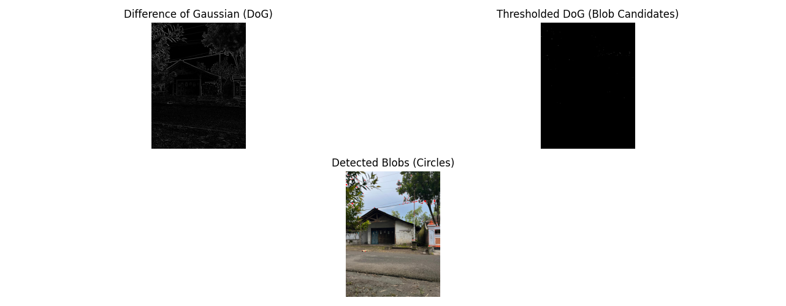
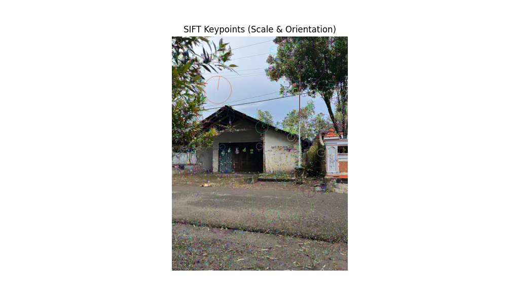
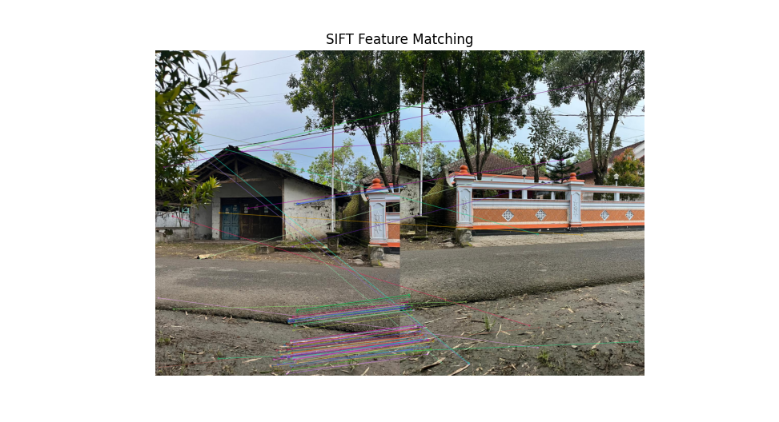
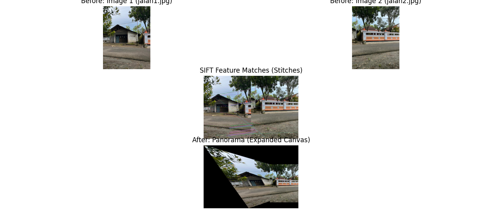

# Implementasi SIFT untuk Panorama Stitching


Repositori ini berisi kode sumber untuk **Final Project Mata Kuliah Visi Komputer**. Proyek ini mengimplementasikan algoritma **Scale-Invariant Feature Transform (SIFT)** untuk mendeteksi fitur pada citra, melakukan pencocokan fitur (*feature matching*), dan menggabungkan dua citra menjadi satu panorama yang utuh (*image stitching*).

## 📋 Deskripsi Proyek

Tujuan utama dari proyek ini adalah memahami dan menerapkan konsep dasar *Feature Detection* dan *Feature Matching*. Algoritma SIFT dipilih karena ketangguhannya (*robustness*) terhadap perubahan skala, rotasi, dan pencahayaan.

Dataset yang digunakan adalah foto **Gedung Al-Fatih, Universitas Darussalam Gontor** yang diambil menggunakan kamera smartphone.

### Fitur Utama:
1.  **Konstruksi Scale-Space:** Simulasi Gaussian Blur pada berbagai level sigma.
2.  **Difference of Gaussian (DoG):** Deteksi blob/fitur kandidat.
3.  **Keypoint Localization:** Penentuan lokasi fitur dan orientasi dominan.
4.  **Feature Matching:** Menggunakan *Brute-Force Matcher* dengan *Lowe's Ratio Test*.
5.  **Panorama Stitching:** Estimasi matriks Homografi (RANSAC) dan *Canvas Expansion* untuk mencegah citra terpotong.

## 🛠️ Teknologi yang Digunakan

* **Python 3.x**
* **OpenCV** (`cv2`): Untuk pemrosesan citra dan implementasi SIFT.
* **NumPy**: Untuk operasi matriks dan manipulasi array.
* **Matplotlib**: Untuk visualisasi hasil (plot grafik dan gambar).

## 🚀 Cara Menjalankan (Instalasi)

1.  **Clone repositori ini:**
    ```bash
    git clone [https://github.com/Mystery-World3/SIFT-Panorama-Stitching.git](https://github.com/Mystery-World3/SIFT-Panorama-Stitching.git)
    cd SIFT-Panorama-Stitching
    ```

2.  **Install library yang dibutuhkan:**
    Pastikan Python sudah terinstal, lalu jalankan perintah berikut di terminal:
    ```bash
    pip install opencv-python numpy matplotlib
    ```

3.  **Struktur Folder:**
    Pastikan Anda memiliki folder `images` untuk input dan folder `output` untuk menyimpan hasil.
    ```
    /SIFT-Panorama-Stitching
    ├── images/             # Letakkan gambar input di sini (gambar1.jpeg, gambar2.jpeg)
    ├── output/             # Hasil visualisasi akan tersimpan di sini
    ├── panoramic.py        # Script utama
    ├── ... (file python lainnya)
    └── README.md
    ```

## 📂 Penjelasan Kode

Berikut adalah fungsi dari setiap file Python dalam repositori ini:

* **`panoramic.py` (Utama)**
    * Menjalankan pipeline lengkap mulai dari deteksi fitur hingga pembuatan panorama akhir.
    * *Output:* Menampilkan hasil stitching di folder `output/`.
    * **Cara Run:** `python panoramic.py`

* **`feature_matching.py`**
    * Fokus menampilkan garis-garis koneksi (*matching lines*) antara dua citra yang valid setelah disaring dengan *Ratio Test*.
    * **Cara Run:** `python feature_matching.py`

* **`keypoints.py` & `orientasi.py`**
    * Memvisualisasikan *keypoint* (lingkaran skala) dan arah orientasi (panah) pada citra tunggal.
    * **Cara Run:** `python keypoints.py`

* **`DoG.py` & `blob_DoG.py`**
    * Menampilkan proses internal algoritma SIFT, yaitu pembentukan citra *Difference of Gaussian* dan deteksi kandidat blob.
    * **Cara Run:** `python DoG.py`

* **`descriptor.py`**
    * Simulasi visualisasi histogram orientasi (deskriptor) pada blok 4x4.
    * **Cara Run:** `python descriptor.py`

## 📊 Hasil Visualisasi

Berikut adalah beberapa hasil output yang tersimpan di folder `output/`:

### 1. Deteksi Fitur & Scale Space
| DoG & Blob Detection | Keypoint Localization |
| :---: | :---: |
|  |  |
| *Deteksi kandidat fitur (Blob)* | *Visualisasi Skala (Lingkaran) & Orientasi* |

### 2. Feature Matching

*Pencocokan fitur antara dua citra menggunakan Brute-Force Matcher & Lowe's Ratio Test.*

### 3. Hasil Akhir Panorama (Stitching)

*Hasil penggabungan dua citra dengan koreksi perspektif dan perluasan kanvas (Expanded Canvas).*

## 👤 Penulis

**Muhammad Mishbahul Muflihin**
* Mahasiswa Teknik Informatika
* Universitas Darussalam Gontor
* Email: muhammadmishbahulmuflihin10@student.cs.unida.gontor.ac.id
